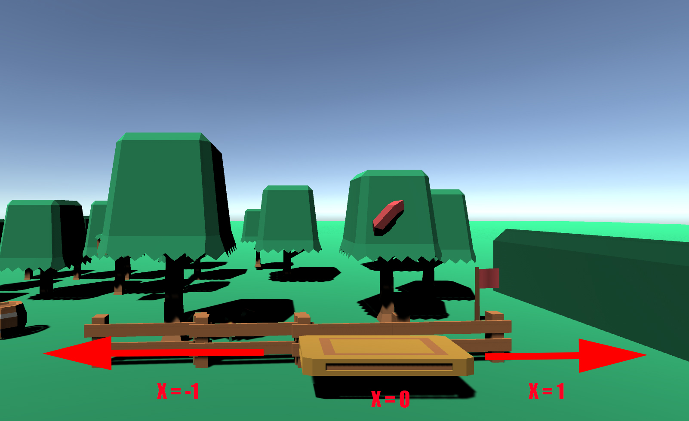

# UnityMachineLearning_Catcher
Smaller project using reinforcement learning in the Unity3D engine to teach an agent how to catch a falling object 
The project does not contain code or any model files from traning sessions in tensorflow, but simply the latest build 
given from Unity. The program is windows native as of writing and I might make builds for MAC OSX or linux if requested. 
To run the program and see the agent in action, simply run the .exe file inside /MachineLearningGame subfolder. 

Huge credit to kenney for providing free game assets for anyone to use, see the link below:
https://www.kenney.nl/assets

# TODO:
1. Upload full project folder with source code
2. Make a full tutorial to achieve the same results and walkthrough the unity ML-interface
3. Increase complexity of the environment(Add more falling objects, add more agents, change the rules and actions?)

